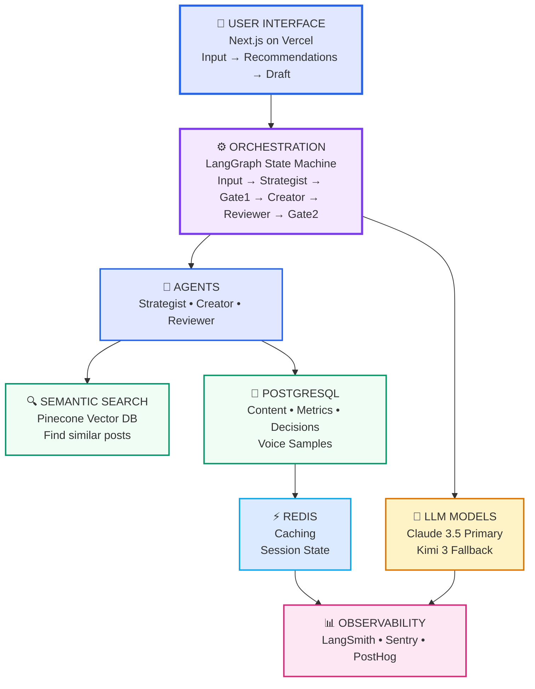
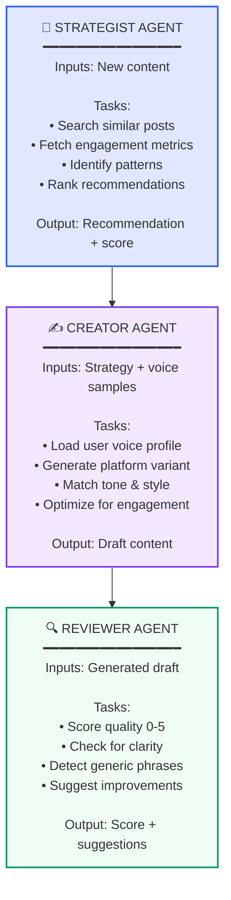
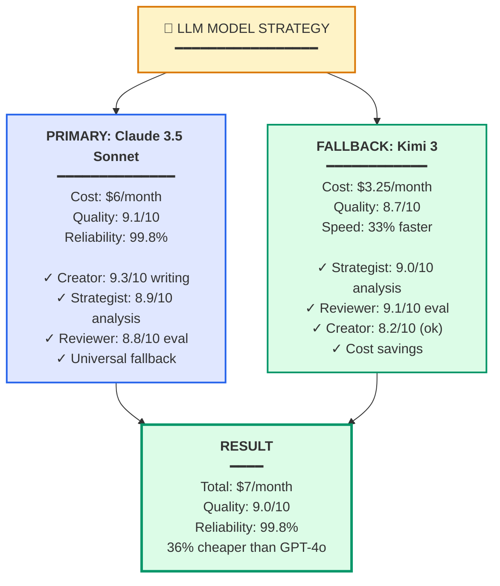
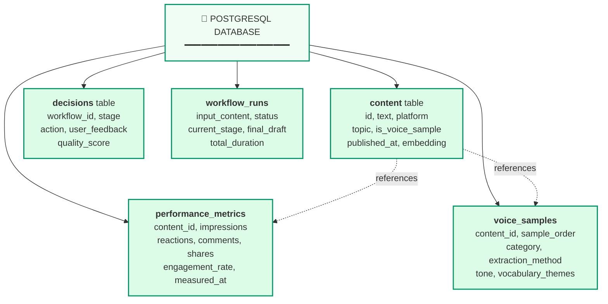
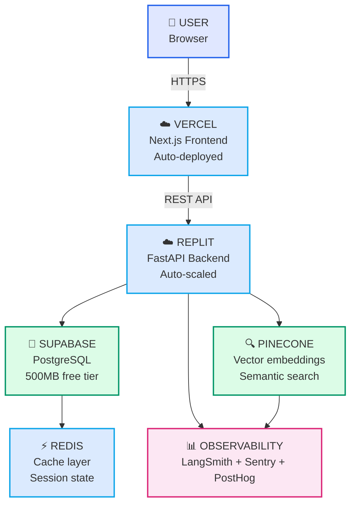

# Content Strategist MVP - Architecture Diagrams (Mermaid)

These diagrams use Mermaid syntax - clear, readable, visual representations.

---

## 1. SYSTEM LAYERS

---

## 2. USER WORKFLOW

```mermaid
graph LR
    A["👤 USER INPUT<br/>Paste content"] 
    B["🤖 STRATEGIST<br/>Find similar posts<br/>Recommend action"]
    C["🚪 GATE 1<br/>Human approves<br/>strategy"]
    D["✍️ CREATOR<br/>Generate draft<br/>in your voice"]
    E["🔍 REVIEWER<br/>Check quality<br/>Score & suggest"]
    F["🚪 GATE 2<br/>Human approves<br/>final draft"]
    G["✅ DONE<br/>Ready to use"]
    
    A --> B --> C --> D --> E --> F --> G
    
    style A fill:#e0e7ff,stroke:#2563eb,stroke-width:2px
    style B fill:#e0e7ff,stroke:#2563eb,stroke-width:2px
    style C fill:#fef3c7,stroke:#d97706,stroke-width:2px
    style D fill:#e0e7ff,stroke:#2563eb,stroke-width:2px
    style E fill:#e0e7ff,stroke:#2563eb,stroke-width:2px
    style F fill:#fef3c7,stroke:#d97706,stroke-width:2px
    style G fill:#dcfce7,stroke:#059669,stroke-width:2px
```

---

## 3. THREE AGENTS DETAILS

---

## 4. DATA FLOW (STRATEGIST EXAMPLE)

```mermaid
graph LR
    INPUT["📝 INPUT<br/>User content<br/>e.g., 'AI in product dev'"]
    
    EMBED["→ EMBEDDING<br/>Convert to vector<br/>1536 dimensions"]
    
    SEARCH["→ SEARCH<br/>Query Pinecone<br/>Find top 5 similar"]
    
    FETCH["→ METRICS<br/>PostgreSQL lookup<br/>Get engagement data"]
    
    ANALYZE["→ ANALYZE<br/>LLM reasoning<br/>Identify patterns"]
    
    OUTPUT["→ OUTPUT<br/>Recommendation<br/>Action + score"]
    
    INPUT --> EMBED --> SEARCH --> FETCH --> ANALYZE --> OUTPUT
    
    style INPUT fill:#e0e7ff,stroke:#2563eb,stroke-width:2px
    style EMBED fill:#fef3c7,stroke:#d97706,stroke-width:2px
    style SEARCH fill:#dcfce7,stroke:#059669,stroke-width:2px
    style FETCH fill:#dbeafe,stroke:#0ea5e9,stroke-width:2px
    style ANALYZE fill:#e0e7ff,stroke:#2563eb,stroke-width:2px
    style OUTPUT fill:#dcfce7,stroke:#059669,stroke-width:2px
```

---

## 5. LLM MODEL CHOICE

---

## 6. DATABASE SCHEMA

---

## 7. DEPLOYMENT ARCHITECTURE

---

## 8. SETUP & DEPLOYMENT FLOW

```mermaid
graph LR
    INIT["make init<br/>━━━━━━━━━━<br/>Setup everything"]
    
    ENV["✓ Validate config<br/>✓ Create venv<br/>✓ Install deps"]
    
    DEV["make dev<br/>━━━━━━<br/>Start local"]
    
    RUN["✓ Run services<br/>✓ Test locally<br/>✓ Build code"]
    
    SEED["make db-seed<br/>━━━━━━━━<br/>Populate data"]
    
    DATA["✓ 15 golden posts<br/>✓ Embeddings<br/>✓ Test data"]
    
    DEPLOY["make deploy-all<br/>━━━━━━━━━━<br/>Ship to cloud"]
    
    LIVE["✓ Backend live<br/>✓ Frontend live<br/>✓ Database ready"]
    
    INIT --> ENV --> DEV --> RUN --> SEED --> DATA --> DEPLOY --> LIVE
    
    style INIT fill:#2563eb,stroke:#1e40af,stroke-width:2px,color:#fff
    style ENV fill:#3b82f6,stroke:#1e40af,stroke-width:2px,color:#fff
    style DEV fill:#7c3aed,stroke:#6d28d9,stroke-width:2px,color:#fff
    style RUN fill:#a78bfa,stroke:#6d28d9,stroke-width:2px,color:#fff
    style SEED fill:#d97706,stroke:#b45309,stroke-width:2px,color:#fff
    style DATA fill:#fbbf24,stroke:#b45309,stroke-width:2px,color:#000
    style DEPLOY fill:#059669,stroke:#047857,stroke-width:2px,color:#fff
    style LIVE fill:#10b981,stroke:#047857,stroke-width:2px,color:#fff
```

---

## 9. QUICK REFERENCE TABLE

| Component | Tool | Why | Cost |
|-----------|------|-----|------|
| **Orchestration** | LangGraph | State machine + gates | Free |
| **Agents** | Claude 3.5 + Kimi 3 | Quality + cost | $7/mo |
| **Vector Search** | Pinecone | Semantic similarity | Free tier |
| **Structured Data** | PostgreSQL | ACID + queries | $0 (Supabase free) |
| **Caching** | Redis | Performance | Free tier |
| **Backend** | FastAPI | Async + type-safe | Free (Replit) |
| **Frontend** | Next.js | SSR + deploy | Free (Vercel) |
| **Observability** | LangSmith + Sentry + PostHog | Full visibility | Free tier |
| **Total Monthly** | — | **All 3 agents** | **$7** |

---

## View These Diagrams

These are Mermaid diagrams. To view them:

1. **GitHub:** Copy-paste into a .md file on GitHub (renders automatically)
2. **Mermaid Live:** Visit https://mermaid.live and paste
3. **VS Code:** Install Markdown Preview Mermaid Support extension
4. **Claude:** Ask me and I can render them as SVG/HTML

---

**Status:** ✅ Clear, visual, understandable architecture
**Format:** Mermaid (readable, navigatable, text-based)
**All Systems:** Defined and justified
