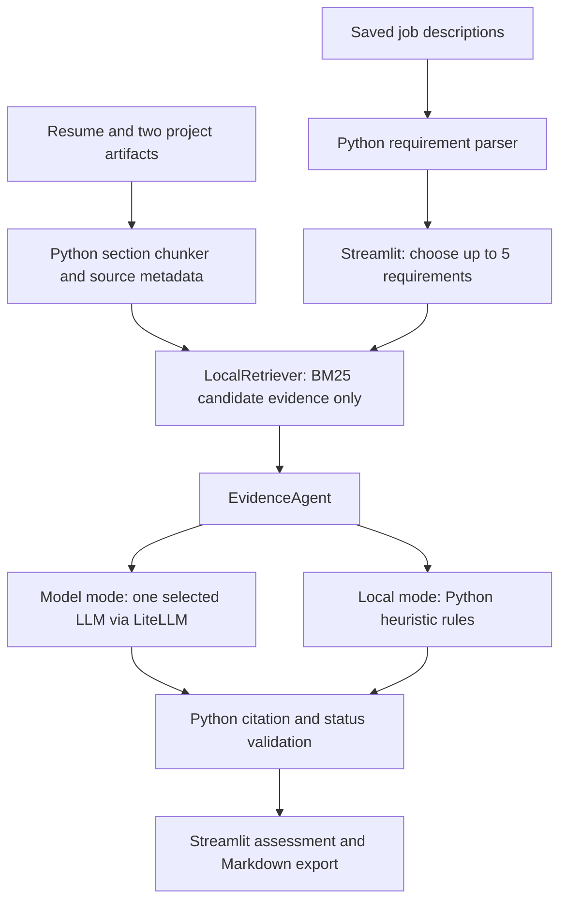

# Almost Qualified

**Know which job requirements you can back up—and what evidence to add next.** Almost Qualified helps career changers compare a saved role with their resume and project notes, then inspect requirement-level assessments with citations.

[Project showcase](https://dev-enthusiast-84.github.io/genai-academy-projects/almost-qualified/) · [Pitch deck](https://dev-enthusiast-84.github.io/genai-academy-projects/almost-qualified/pitch_deck.html) · [Two-minute script](docs/pitch_script.md) · [Architecture](docs/ARCHITECTURE.md) · [Deployment guide](docs/DEPLOYMENT.md)

The showcase links become available after the site files are published to GitHub Pages. Open the [local showcase](site/index.html) or [local deck](docs/pitch_deck.html) directly in a browser to preview them. A live Streamlit app URL has not been recorded here.

## Project one-liner

> My RAG app helps career changers answer which job requirements their documented experience supports and what evidence is missing, from one resume, two project artifacts, and three saved job descriptions, in a Streamlit evidence workspace, targeting 95% faithfulness and 80% retrieval precision@5.

This follows the [Week 2 handout](../project-handout/Week%202%20Project%20Handout%20%28Aug%202026%29.pdf). The six-document demo corpus is fictional. The percentages are quality targets, not measured results.

## Features

- **Choose a role:** select a saved job description and up to five extracted requirements.
- **Assess support:** get Supported, Partially supported, or No evidence found labels, with explanations.
- **Inspect proof:** open source IDs and exact citation excerpts; review evidence that narrows a claim.
- **Close documentation gaps:** see missing evidence and suggested next steps.
- **Take the result with you:** download a Markdown assessment for application or interview preparation.
- **Choose a model:** use one configured model through LiteLLM, or enter a custom model ID.
- **Try without credentials:** switch off model assessment for deterministic local rules and retrieval.

For example, a Streamlit project can support an app-building requirement, while its deployment instructions only partially support a deployment requirement. A Kubernetes requirement may have no supporting evidence; Kubernetes is not part of this app's infrastructure.

## Architecture at a glance



**Only `EvidenceAgent` uses an LLM for assessment.** The parser, chunker, BM25 retriever, validator, and export are Python code. Job descriptions provide questions, never candidate evidence. There is no embedding model or vector database in the MVP.

| Agent / component | Model or implementation | Role |
| --- | --- | --- |
| `EvidenceAgent` — default model mode | OpenAI GPT-4 Turbo (`gpt-4-turbo`) | Assess retrieved excerpts; return structured labels, explanations, citations, gaps, and next steps |
| Same agent — selectable alternative | OpenAI GPT-4o mini (`gpt-4o-mini`) | Same assessment task |
| Same agent — selectable alternative | Google Gemini 2.0 Flash (`gemini-2.0-flash`) | Same assessment task |
| Same agent — selectable alternative | Anthropic Claude 3.5 Sonnet (`claude-3-5-sonnet-20241022`) | Same assessment task |
| Same agent — local mode | Python heuristic rules; no model | Demo assessment without an API key |
| All other pipeline components | Python; no model | Parse, chunk, retrieve, validate, render, export |

These are the configured choices in `model_config.py`, not a record of a live model run or a guarantee of provider availability. One model is selected per assessment. The **Check model** button makes a separate readiness call to the selected model.

## Run locally

Install [uv](https://docs.astral.sh/uv/getting-started/installation/). From the repository root:

```bash
cd week2/almost-qualified
uv sync --python 3.14
uv run python ingest.py --corpus demo
uv run streamlit run app.py
```

Open the local URL printed by Streamlit. Turn **Use model assessment** off to try the demo without credentials. For model mode, follow the [API key setup](docs/DEPLOYMENT.md#optional-model-credentials).

## Deploy

For Streamlit Community Cloud, select this repository, the branch containing the app, and entrypoint `week2/almost-qualified/app.py`. Choose Python **3.14** in Advanced settings to match the current lockfile; add provider secrets only for model mode. Follow the [complete deployment and smoke-check instructions](docs/DEPLOYMENT.md).

The static GitHub Pages showcase and the Python Streamlit app are separate deployments. GitHub Pages presents the project and pitch deck; it does not execute the assessment app.

## Evaluation and limitations

From `week2/almost-qualified`:

```bash
uv run python evaluate.py --corpus demo
uv run --with pytest pytest tests/test_boundaries.py
```

The evaluator writes `submission_artifacts/evaluation_results.json`. It checks local-mode status expectations, expected source coverage, and citation validation. It **does not yet measure faithfulness or retrieval precision@5**, and it does not evaluate live LLM responses.

BM25 can miss paraphrases. Local assessment relies on fixed keyword rules, and citation validation does not prove the reasoning is correct. “No evidence found” describes the available documents, not the person's ability.

## Project files

| Path | Purpose |
| --- | --- |
| `app.py` | Streamlit controls, results, and report download |
| `agent.py` / `model_config.py` | Evidence assessment, provider selection, and model calls |
| `rag.py` / `ingest.py` | Corpus loading, chunking, manifest, and BM25 search |
| `schemas.py` | Dataclass output structures and citation validation |
| `data/demo/` | Fictional candidate and job documents |
| `evals/` / `tests/` | Labeled demo cases and boundary checks |
| `docs/` | Architecture, deployment, pitch deck, and speaker script |
| `site/` | Project-owned GitHub Pages showcase source |
| `scripts/sync_showcase.py` | Copy reviewed public assets into the repository's Pages folder |
