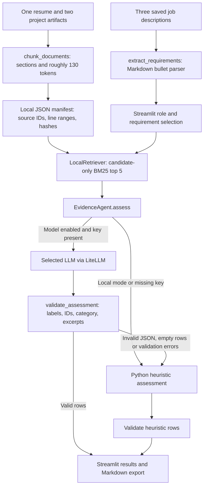

# Almost Qualified architecture

Almost Qualified is a single-agent RAG evidence workspace. It asks whether candidate documents support individual job requirements. The current implementation uses local BM25 keyword retrieval, not vector search.

[Project overview](../README.md) · [Pitch deck](pitch_deck.html) · [Deployment](DEPLOYMENT.md)

## Data flow

## Components and LLM boundaries

| Component | Implementation | Uses an LLM? |
| --- | --- | --- |
| Requirement extraction | `rag.extract_requirements` reads bullets under the requirements heading | No |
| Ingestion | `read_demo_documents` and `chunk_documents`; split at headings and around 130 tokens | No |
| Retrieval | `LocalRetriever`, custom BM25 scoring in Python; up to five positive-score candidate chunks per query | No |
| Evidence assessment | `EvidenceAgent._model_assess`, one LiteLLM call for the selected requirement batch | Yes, in model mode |
| Local assessment | `EvidenceAgent._heuristic_row`, fixed keyword and evidence rules | No |
| Validation | `schemas.validate_assessment`, dataclasses and Python checks | No |
| UI and export | Streamlit and `render_markdown` | No |
| Readiness check | `check_model_ready` sends a short prompt to the selected model | Yes, only when the user clicks Check model |

## Agent-to-model mapping

There is one agent, `EvidenceAgent`; the following are alternative model choices for that same agent, not separate agents running together.

| Selection | Exact configured model ID | Credential |
| --- | --- | --- |
| **Default: OpenAI GPT-4 Turbo** | `gpt-4-turbo` | `OPENAI_API_KEY` |
| OpenAI GPT-4o mini | `gpt-4o-mini` | `OPENAI_API_KEY` |
| Google Gemini 2.0 Flash | `gemini-2.0-flash` | `GOOGLE_API_KEY` |
| Anthropic Claude 3.5 Sonnet | `claude-3-5-sonnet-20241022` | `ANTHROPIC_API_KEY` |

`model_config.py` is the source of truth. The sidebar defaults to the first catalog entry and allows a custom model ID. Provider access and compatibility must be checked for the chosen ID; this table documents configuration, not successful live calls. There is no embedding model, reranking model, or planner model.

The model receives requirement text, candidate excerpts and IDs, retrieval scores, allowed labels, and grounding rules. It returns structured assessment rows with status, explanation, citations, missing evidence, and a next step. The request uses temperature 0 and requests JSON for the configured model families.

## Evidence boundaries and fallback behavior

- Only candidate chunks are indexed for evidence retrieval. Job descriptions cannot substantiate experience.
- Validation checks allowed status labels, known chunk IDs, candidate source category, and excerpt membership. A No evidence found row must not cite evidence.
- Weak evidence can be labeled Partially supported; deployment instructions do not establish production operation.
- Disabling model assessment or omitting the key selects local rules. Some invalid model outputs also trigger those rules.
- Provider/network exceptions and malformed output shapes are not comprehensively caught by the agent; do not assume every model failure falls back automatically.
- Citation checks validate references, not the truth of the model's conclusion. The UI displays validation notes when returned.

## Corpus, storage, and deployment

The demo contains six Markdown files: one resume, two project artifacts, and three saved job descriptions. `ingest.py` creates a local JSON manifest with source metadata, line ranges, and content hashes. App startup rebuilds the manifest for the demo corpus. There is no database service, embedding API, or Kubernetes infrastructure.

Local mode assesses on the host machine. Model mode sends selected requirements and candidate excerpts to the chosen provider through LiteLLM. The demo corpus is fictional. Temporary keys are held in the Streamlit session rather than written by the app to disk.

The Streamlit app runs locally or on a Python hosting service. The static GitHub Pages showcase and deck are separate public artifacts; Pages does not run the Python app.

## Evaluation scope

The local evaluator checks expected labels, source coverage, and validation errors. Boundary tests cover job-text exclusion and partial deployment evidence. The 95% faithfulness and 80% precision@5 figures are targets; the current evaluator does not calculate those metrics. Semantic retrieval and live-model evaluation are potential extensions, not implemented features.
