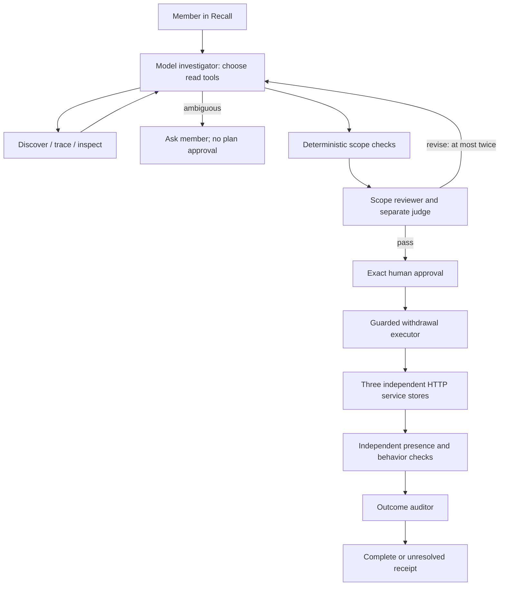

# Architecture

Recall's primary implementation is the connected Python app. LangGraph coordinates review and execution, while application code enforces authorization and durable recovery.

## Components

| File | Responsibility |
| --- | --- |
| `app.py` | Streamlit form, provider selection, approval, readable evidence, receipt and recovery controls |
| `withdrawal/agent.py` | Direct OpenAI/OpenRouter client and bounded model-selected read-tool loop |
| `withdrawal/review.py` | LangGraph review stages, conditional repair edges, hard checks, separate judge and outcome audit |
| `withdrawal/workflow.py` | LangGraph approved execution → verification/audit; interrupted execution stops before audit |
| `withdrawal/core.py` | SQLite workflow state, authorization hash, consent/suppression, dependency order, retries, verification |
| `withdrawal/service_app.py` | Standard-library HTTP server, one SQLite store and customer page per service |
| `withdrawal/services.py` | Authenticated HTTP adapter; no direct cross-service database access |
| `withdrawal/mcp_server.py`, `mcp_client.py` | Optional official MCP SDK read transport; no model write tools |
| `withdrawal/notifications.py` | Optional fixed-destination Slack status notification, deduplicated before network I/O |
| `run_demo.py`, `withdrawal/manage.py` | Start customer servers/dashboard, propagate scoped configuration, stop owned processes |
| `site/` | Separate browser demo with simulated stores and one model investigator |

The running customer services use `ThreadingHTTPServer`, not Flask. Each listens on loopback and owns a SQLite file; the default connected data root is `.runtime/fitness`, with `applications/` and `recall/` subdirectories. The standalone engine used in tests can instead own local store files without HTTP.

## Graph boundaries

The review graph is investigator → hard checks → scope reviewer → judge → decision. A revision routes through a repair node back to investigation, at most twice. Clarification, failed checks, or malformed model output stop approval. Node names are saved in request telemetry with `framework: langgraph`.

The review graph ends at the persisted approval boundary. The existing UI obtains explicit approval, and the execution graph calls Engine's guarded executor before verification/audit. Resume reads the saved request and retry counters from SQLite. There is no parallel execution, automatic graph retry around deletes, or second graph checkpoint database. An interrupted investigation must be prepared again; approved execution can resume through the existing controls. Direct Verify again still runs verification/audit without executing deletion.

The outcome auditor receives the approved target list and fresh states; retained catalog metadata does not imply retained service data. Preserved IDs overlapping removed targets are rejected.

## State and approval

The workflow SQLite tables are `catalog`, `edges`, `requests`, `suppression`, `faults`, `consent`, and `notifications`. Targets, reviews, events, approval and verification are nested in each request's JSON payload; they are not independent SQL tables.

Approval hashes the exact roots, target IDs/services/versions, edges, scope, consent roots and retry limit, and expires after 24 hours. Before writes the engine checks approval, current lineage and accessible versions; a changed scope requires a new plan. It writes local consent withdrawal and suppression, attempts service-level blocks, deletes dependents before ancestors, and verifies presence independently.

At most three delete attempts are made per target. A lost response triggers inspection before retry. An offline service is unknown and leaves the result partial; an outcome auditor cannot upgrade failed checks. One unresolved auditor finding also leaves the combined outcome unresolved.

Request payload cleanup occurs when the app runs and removes requests older than 24 hours from creation; it is not a background erasure service. Consent, lineage and suppression remain until reset. Local `.env` credentials persist on disk; they are not written into workflow receipts. Separate submitted investigations do not replay past conversation; bounded repair context is passed within a review run.

## Scope limits

Synthetic single-user identity U1; no production login or tenant isolation service. Tool metadata omits source content, but the customer pages and lexical search display synthetic content, and requests/model explanations may be sensitive. The notification tool sends fixed status text only, after explicit operator opt-in; it does not send the queued invitation.

No external queue sender, embeddings/vector database, backup deletion, external SaaS deletion, or model unlearning is implemented. Stable-ID ingestion blocks apply only to the controlled demo paths. The hosted app shares one origin/localStorage across its pages and cannot establish backend security or independent service availability.
